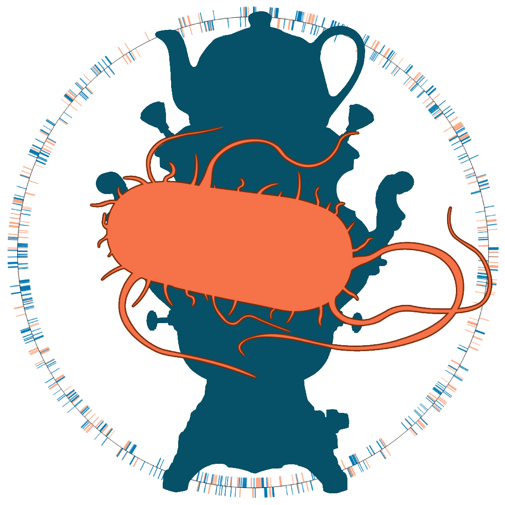

# SalmoVar
Salmonella variant-calling pipeline

The overall goal of this project is to generate a large *Salmonella enterica* variant database for applications in machine learning and genomics. 

### Contributors
Annette M. Hynes, Lei Ma, Adam R. Rivers
